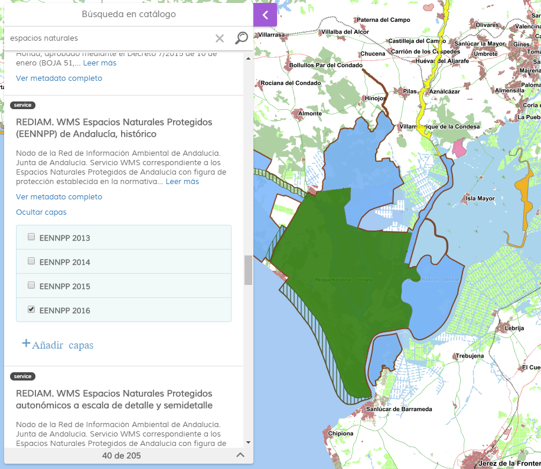

<p align="center">
  
</p>
<h1 align="center"><strong>API IDEE</strong> <small>🔌 IDEE.plugin.CatalogSearch</small></h1>

# Descripción
Plugin de Mapea desarrollado por el Instituto de Estadística y Cartografía dedicado a realizar búsquedas sobre un catálogo de metados implementado con Geonetwork.

Al realizar la búsqueda, si alguno de los resultados es un servicio OGC, permitirá consultar las capas del mismo y añadirlas al mapa de forma interactiva



# Dependencias
Para que el plugin funcione correctamente es necesario importar las siguientes dependencias en el documento html:
Para uso de implementación OpenLayers:
- **catalogsearch.ol.min.js**
- **catalogsearch.ol.min.css**

Para uso de implementación Cesium:
- **catalogsearch.cesium.min.js**
- **catalogsearch.cesium.min.css**

# Uso del histórico de versiones

Existe un histórico de versiones de todos los plugins en el directorio `legacy/` de cada plugin. 
Es recomendable fijar las versiones para evitar errores inesperados.

Ejemplo con el plugin CatalogSearch, implementación OpenLayers y versión 1.0.0:
- **catalogsearch-1.0.0.ol.min.css**
- **catalogsearch-1.0.0.ol.min.js**

## Parámetros

El constructor se inicializa con un JSON con los siguientes atributos:

- **geoNetworkUrl**. URL de geoNetwork.
- **collapsible**. Si es *true*, el botón aparece, y puede desplegarse y contraerse. Si es *false*, el botón no aparece. Por defecto tiene el valor *true*.
- **classname**. Indica una clase CSS para aplicar al panel.


# API-REST

```javascript
URL_API?catalogsearch=collapsible*geoNetworkUrl*classname
```

<table>
    <tr>
        <th>Parámetros</th>
        <th>Opciones/Descripción</th>
        <th>Disponibilidad</th>
    </tr>
    <tr>
        <td>geoNetworkUrl</td>
        <td>URL GeoNetwork</td>
        <td>Base64 ✔️ | Separador ✔️</td>
    </tr>
     <tr>
        <td>collapsible</td>
        <td>true/false</td>
        <td>Base64 ✔️ | Separador ✔️</td>
    </tr>
    <tr>
        <td>classname</td>
        <td>Valor a usar como identificador de clase CSS para aplicar al panel</td>
        <td>Base64 ✔️ | Separador ✔️</td>
    </tr>
</table>


### Ejemplos de uso API-REST
```
https://componentes.idee.es/api-idee?catalogsearch=collapsible*geoNetworkUrl*classname
```

```
https://componentes.idee.es/api-idee?catalogsearch=false*http://www.ideandalucia.es/catalogo/inspire/srv/spa*m-catalogsearch
```

### Ejemplo de uso API-REST en base64

Para la codificación en base64 del objeto con los parámetros del plugin podemos hacer uso de la utilidad IDEE.utils.encodeBase64.
Ejemplo:
```javascript
IDEE.utils.encodeBase64(obj_params);
```

Ejemplo de constructor:
```javascript
{
  geoNetworkUrl: 'http://www.ideandalucia.es/catalogo/inspire/srv/spa',
  classname: 'm-catalogsearch',
  collapsible: false
}
```
```
https://componentes.idee.es/api-idee?catalogsearch=base64=eyJnZW9OZXR3b3JrVXJsIjoiaHR0cDovL3d3dy5pZGVhbmRhbHVjaWEuZXMvY2F0YWxvZ28vaW5zcGlyZS9zcnYvc3BhIiwiY2xhc3NuYW1lIjoibS1jYXRhbG9nc2VhcmNoIiwiY29sbGFwc2libGUiOmZhbHNlfQ==
```


## Ejemplos de uso

### Ejemplo 1
```javascript
   const map = IDEE.map({
     container: 'map'
   });

   const mp = new IDEE.plugin.CatalogSearch({});

   map.addPlugin(mp);
```
### Ejemplo 2
```javascript
const mp = new IDEE.plugin.CatalogSearch({
  geoNetworkUrl: 'http://www.ideandalucia.es/catalogo/inspire/srv/spa',
  classname: 'm-catalogsearch',
  collapsible: false
});

map.addPlugin(mp);
```
### Ejemplo 3
```javascript
const mp = new IDEE.plugin.CatalogSearch({});

map.addPlugin(mp);
```


# 👨‍💻 Desarrollo

Para el stack de desarrollo de este componente se ha utilizado

* NodeJS Version: 14.16
* NPM Version: 6.14.11

## 📐 Configuración del stack de desarrollo / *Work setup*


### 🐑 Clonar el repositorio / *Cloning repository*

Para descargar el repositorio en otro equipo lo clonamos:

```bash
git clone [URL del repositorio]
```

### 1️⃣ Instalación de dependencias / *Install Dependencies*

```bash
npm i
```

### 2️⃣ Arranque del servidor de desarrollo / *Run Application*

```bash
npm start:ol
npm start:cesium
```

## 📂 Estructura del código / *Code scaffolding*

```any
/
├── src 📦                  # Código fuente
├── task 📁                 # EndPoints
├── test 📁                 # Testing
├── webpack-config 📁       # Webpack configs
└── ...
```
## 📌 Metodologías y pautas de desarrollo / *Methodologies and Guidelines*

Metodologías y herramientas usadas en el proyecto para garantizar el Quality Assurance Code (QAC)

* ESLint
  * [NPM ESLint](https://www.npmjs.com/package/eslint) \
  * [NPM ESLint | Airbnb](https://www.npmjs.com/package/eslint-config-airbnb)

## ⛽️ Revisión e instalación de dependencias / *Review and Update Dependencies*

Para la revisión y actualización de las dependencias de los paquetes npm es necesario instalar de manera global el paquete/ módulo "npm-check-updates".

```bash
# Install and Run
$npm i -g npm-check-updates
$ncu
```