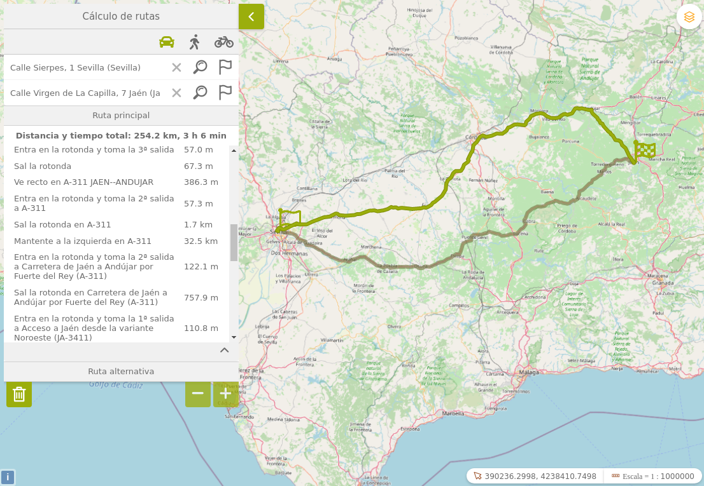

<p align="center">
  
</p>
<h1 align="center"><strong>API IDEE</strong> <small>🔌 IDEE.plugin.Findroute</small></h1>

# Descripción
Plugin búsqueda de rutas OSRM para Mapea desarrollado por el Servicio de Transformación Digital de la Secretaría General de Medio Ambiente, Agua y Cambio Climático como una funcionalidad incorporada al constructor de visores GRAMA.

Este plugin **precisa para desplegar toda su potencialidad de una infraestructura propia de Open Source Routing Machine (OSRM) 3** que se encarga de proporcionar los servicios de enrutamiento.

Como alternativa, bastaría con la utilización de los servicios en la nube de openstreetmap. La limitación de dichos servicios en la nube versa sobre la incapacidad de seleccionar tipos de locomoción en el cálculo de las rutas.




# Dependencias
Para que el plugin funcione correctamente es necesario importar las siguientes dependencias en el documento html:
Para uso de implementación OpenLayers:
- **findroute.ol.min.js**
- **findroute.ol.min.css**

Para uso de implementación Cesium:
- **findroute.cesium.min.js**
- **findroute.cesium.min.css**

# Uso del histórico de versiones

Existe un histórico de versiones de todos los plugins en el directorio `legacy/` de cada plugin. 
Es recomendable fijar las versiones para evitar errores inesperados.

Ejemplo con el plugin Findroute, implementación OpenLayers y versión 1.0.0:
- **findroute-1.0.0.ol.min.css**
- **findroute-1.0.0.ol.min.js**

## Parámetros

El constructor se inicializa con un JSON con los siguientes atributos:

- **osrmurl**: URL del servicio Open Source Routing Machine (OSRM) con el motor para el cálculo de
rutas. Opcional, en caso de no indicarlo, el plugin usará la URL del servicio de pruebas de OSRIDEE.
- **osrmurlAlternativa**: URL del servicio de pruebas de OSRIDEE. Obligatorio.
- **panel**: Posición del panel del plugin en el visor. Opcional, por defecto arriba a la izquierda.
- **conflictedPlugins**: Lista de plugins a desactivar al activar el mismo. Opcional.
- **urlGeocoderInverso**: URL del servicio de geocoder inverso del Callejero de Andalucia Unificado.
- **searchstreetUrl**: URL del servicio de geocodificación de calles (Searchstreet). Opcional, por defecto usa `https://ws248.juntadeandalucia.es/EXT_PUB_CallejeroREST/geocoderMunProvSrs`.
- **searchstreetNormalizar**: URL del servicio de normalización de direcciones. Opcional, por defecto usa `https://ws248.juntadeandalucia.es/EXT_PUB_CallejeroREST/normalizar`. 


# API-REST

```javascript
URL_API?findroute=osrmurl*osrmurlAlternativa*position*conflictedPlugins*urlGeocoderInverso*searchstreetUrl*searchstreetNormalizar
```

<table>
    <tr>
        <th>Parámetros</th>
        <th>Opciones/Descripción</th>
        <th>Disponibilidad</th>
    </tr>
    <tr>
        <td>osrmurl</td>
        <td>URL OSRM</td>
        <td>Base64 ✔️ | Separador ✔️</td>
    </tr>
     <tr>
        <td>osrmurlAlternativa</td>
        <td>URL OSRIDEE</td>
        <td>Base64 ✔️ | Separador ✔️</td>
    </tr>
    <tr>
        <td>position</td>
        <td>.m-bottom.m-left",.m-bottom.m-right,.m-top.m-left,.m-top.m-right</td>
        <td>Base64 ✔️ | Separador ✔️</td>
    </tr>
         <tr>
        <td>conflictedPlugins</td>
        <td>Lista de plugins a desactivar al activar el mismo</td>
        <td>Base64 ✔️ | Separador ✔️</td>
    </tr>
         <tr>
        <td>urlGeocoderInverso</td>
        <td>URL del servicio de geocoder inverso</td>
        <td>Base64 ✔️ | Separador ✔️</td>
    </tr>
         <tr>
        <td>searchstreetUrl</td>
        <td>URL del servicio de geocodificación</td>
        <td>Base64 ✔️ | Separador ✔️</td>
    </tr>
         <tr>
        <td>searchstreetNormalizar</td>
        <td>URL del servicio de normalización</td>
        <td>Base64 ✔️ | Separador ✔️</td>
    </tr>
</table>

### Ejemplos de uso API-REST
```
https://componentes.idee.es/api-idee?findroute=osrmurl*osrmurlAlternativa*position*conflictedPlugins*urlGeocoderInverso*searchstreetUrl*searchstreetNormalizar
```

```
https://componentes.idee.es/api-idee?findroute=*https://router.project-osrm.org*.m-top.m-left*navigation,tools*http://ws248.juntadeandalucia.es/EXT_PUB_CallejeroREST/geocoderInversoSrs*https://ws248.juntadeandalucia.es/EXT_PUB_CallejeroREST/geocoderMunProvSrs*https://ws248.juntadeandalucia.es/EXT_PUB_CallejeroREST/normalizar&layers=OSM&projection=EPSG:25830
```

### Ejemplo de uso API-REST en base64

Para la codificación en base64 del objeto con los parámetros del plugin podemos hacer uso de la utilidad IDEE.utils.encodeBase64.
Ejemplo:
```javascript
IDEE.utils.encodeBase64(obj_params);
```

Ejemplo de constructor:
```javascript
{
  options: {
    searchstreetUrl: 'https://ws248.juntadeandalucia.es/EXT_PUB_CallejeroREST/geocoderMunProvSrs',
    searchstreetNormalizar: 'https://ws248.juntadeandalucia.es/EXT_PUB_CallejeroREST/normalizar',
    osrmurlAlternativa: "https://router.project-osrm.org",
    panel: {
      position: '.m-bottom.m-left'
    },
    conflictedPlugins: ["navigation", "tools", "panelSelectByPolygon"],    
    urlGeocoderInverso: "http://ws248.juntadeandalucia.es/EXT_PUB_CallejeroREST/geocoderInversoSrs"
  }
}
```

```
https://componentes.idee.es/api-idee?findroute=base64=eyJvcHRpb25zIjp7InNlYXJjaHN0cmVldFVybCI6Imh0dHBzOi8vd3MyNDguanVudGFkZWFuZGFsdWNpYS5lcy9FWFRfUFVCX0NhbGxlamVyb1JFU1QvZ2VvY29kZXJNdW5Qcm92U3JzIiwic2VhcmNoc3RyZWV0Tm9ybWFsaXphciI6Imh0dHBzOi8vd3MyNDguanVudGFkZWFuZGFsdWNpYS5lcy9FWFRfUFVCX0NhbGxlamVyb1JFU1Qvbm9ybWFsaXphciIsIm9zcm11cmxBbHRlcm5hdGl2YSI6Imh0dHBzOi8vcm91dGVyLnByb2plY3Qtb3NybS5vcmciLCJwYW5lbCI6eyJwb3NpdGlvbiI6Ii5tLWJvdHRvbS5tLWxlZnQifSwiY29uZmxpY3RlZFBsdWdpbnMiOlsibmF2aWdhdGlvbiIsInRvb2xzIiwicGFuZWxTZWxlY3RCeVBvbHlnb24iXSwidXJsR2VvY29kZXJJbnZlcnNvIjoiaHR0cDovL3dzMjQ4Lmp1bnRhZGVhbmRhbHVjaWEuZXMvRVhUX1BVQl9DYWxsZWplcm9SRVNUL2dlb2NvZGVySW52ZXJzb1NycyJ9fQ==&layers=OSM&projection=EPSG:25830
```

## Ejemplo de uso

```javascript
const mp = new IDEE.plugin.Findroute({
  options: {
    osrmurlAlternativa: "https://router.project-osrm.org",
    panel: {
      position: IDEE.ui.position.TL
    },
    conflictedPlugins: ["navigation", "tools", "panelSelectByPolygon"],    
    urlGeocoderInverso: "http://ws248.juntadeandalucia.es/EXT_PUB_CallejeroREST/geocoderInversoSrs",
    searchstreetUrl: 'https://ws248.juntadeandalucia.es/EXT_PUB_CallejeroREST/geocoderMunProvSrs',
    searchstreetNormalizar: 'https://ws248.juntadeandalucia.es/EXT_PUB_CallejeroREST/normalizar',
  }
});

// add here the plugin into the map
myMap.addPlugin(mp);
```
## Infraestructura OSRM
Como se ha mencionado anteriormente, la utilización de todos los tipos de medios de locomoción en el cálculo de rutas requiere de la instalación de OSRM en una infraestructura propia.

A continuación se describen los pasos para realizar dicha instalación mediante Docker.

**Requisitos**

- Disponer del producto Docker instalado en la máquina donde se pretende desplegar OSRM, con las imágenes osrm-backend (openstreetmap) y nginx . La descarga de una imagen, requiere ejecutar: 
```shell
docker pull NOMBRE_IMAGEN
```
- Disponer del archivo del tipo osm.pbf con los datos de Andalucía (en concreto: andalucia-latest.osm.pbf ) descargable desde la ruta de openstreetmap siguiente:
https://download.openstreetmap.fr/extracts/europe/spain/
- Se precisan la utilización de tres puertos y un mínimo de 2 Gbytes. Además para el nginx se precisará otro puerto más y unos 256 megabytes de memoria.

**Instalación**

1.- Levantar la imagen de docker osrm-backend descargada de openstreetmap:
```shell
$ docker run -dit -p PUERTO_HOST_1:5000 -v “RUTA_HOST:/data” -p PUERTO_HOST_2:5001 -p PUERTO_HOST_3:5002 --memory=”2048m” osrm/osrm-backend
```
2.- Una vez que Docker esté levantado y el archivo osm.pbf accesible desde dentro del contenedor, el siguiente paso implica colocar el citado archivo en tres carpetas distintas. Esto es preciso para disponer de los perfiles correspondientes a los modos de locomoción (coche, bicicleta y a pie) activos a la vez. Hay que tener la precaución de no colocarlos en la misma carpeta, puesto que se acabarían sobrescribiendo datos. Por ejemplo:
- /any/path/car/andalucia-latest.osm.pbf
- /any/path/foot/andalucia-latest.osm.pbf
- /any/path/bicycle/andalucia-latest.osm.pbf

3.- Una vez completado el paso anterior, se tendrán que ejecutar los siguientes comandos:
```shell
$ osrm-extract -p /opt/car.lua /any/path/car/andalucia-latest.osm.pbf
$ osrm-partition /any/path/car/andalucia-latest.osrm
$ osrm-customize /any/path/car/andalucia-latest.osrm
$ osrm-routed --port 5000 --algorithm mld /any/path/car/andalucia-latest.osrm
```
Con ello, se ha conseguido tener desplegado el servicio para rutas con coche en el puerto 5000 (cámbiese al puerto que se desee según las directrices de la infraestructura interna de la organización donde se ubique OSRM) dentro del contenedor y en la ruta PUERTO_HOST_1 en el host.

4.- Se repitirá el paso anterior para las rutas a pie y con bici.
```shell
$ osrm-extract -p /opt/foot.lua /any/path/foot/andalucia-latest.osm.pbf
$ osrm-partition /any/path/foot/andalucia-latest.osrm
$ osrm-customize /any/path/foot/andalucia-latest.osrm
$ osrm-routed --port 5001 --algorithm mld /any/path/foot/andalucia-latest.osrm
$ osrm-extract -p /opt/bicycle.lua /any/path/bicycle/andalucia-latest.osm.pbf
$ osrm-partition /any/path/bicycle/andalucia-latest.osrm
$ osrm-customize /any/path/bicycle/andalucia-latest.osrm
$ osrm-routed --port 5002 --algorithm mld /any/path/bicycle/andalucia-latest.osrm
```
En este momento ya se encuentran desplegados los servicios de enrutamiento en el
contenedor.

5.- Instalación de Nginx que actuará como proxy redirigiendo todas las peticiones en función son a pie, con coche o con bicicleta. Para levantar el contenedor, se ejecutará:
```shell
$ docker run -dit -p PUERTO_HOST:80 --memory=”256m” nginx
```
Una vez activo, se modificará el archivo de configuración del proxy. Este archivo se encuentra en /etc/nginx/nginx.conf. En este fichero, se incluirá lo siguiente dentro del http{}:
```shell
server {
listen 80 default_server; listen[::]:80 default_server ipv6only=on;
location /route/v1/driving {proxy_pass IP_HOST:PUERTO_HOST_1}
location /route/v1/walking {proxy_pass IP_HOST:PUERTO_HOST_2}
location /route/v1/cycling {proxy_pass IP_HOST:PUERTO_HOST_3}
location /nearest/v1/driving {proxy_pass IP_HOST:PUERTO_HOST_1}
location /nearest/v1/walking {proxy_pass IP_HOST:PUERTO_HOST_2}
location /nearest/v1/cycling {proxy_pass IP_HOST:PUERTO_HOST_3}
location / {
add_header Content-Type text/plain;
return 404 Your request is bad ;}
}
```
Una vez añadido, se reinicia el servicio con el comando:
```shell
$ nginx -s reload
```
Una vez completados los pasos anteriores, se dispone de un OSRM desplegado en la infraestructura local con lo que ya se puede proceder a realizar al servicio de enrutamiento.


# 👨‍💻 Desarrollo

Para el stack de desarrollo de este componente se ha utilizado

* NodeJS Versión: 16 o superior
* NPM Versión: 8.19.4 o superior

## 📐 Configuración del stack de desarrollo / *Work setup*


### 🐑 Clonar el repositorio / *Cloning repository*

Para descargar el repositorio en otro equipo lo clonamos:

```bash
git clone [URL del repositorio]
```

### 1️⃣ Instalación de dependencias / *Install Dependencies*

```bash
npm i
```

### 2️⃣ Arranque del servidor de desarrollo / *Run Application*

```bash
npm run start:ol
npm run start:cesium
```

## 📂 Estructura del código / *Code scaffolding*

```any
/
├── src 📦                  # Código fuente
├── legacy 📁               # Histórico de versiones
├── task 📁                 # EndPoints
├── test 📁                 # Testing
├── webpack-config 📁       # Webpack configs
└── ...
```
## 📌 Metodologías y pautas de desarrollo / *Methodologies and Guidelines*

Metodologías y herramientas usadas en el proyecto para garantizar el Quality Assurance Code (QAC)

* ESLint
  * [NPM ESLint](https://www.npmjs.com/package/eslint) \
  * [NPM ESLint | Airbnb](https://www.npmjs.com/package/eslint-config-airbnb)

## ⛽️ Revisión e instalación de dependencias / *Review and Update Dependencies*

Para la revisión y actualización de las dependencias de los paquetes npm es necesario instalar de manera global el paquete/ módulo "npm-check-updates".

```bash
# Install and Run
$npm i -g npm-check-updates
$ncu
```

