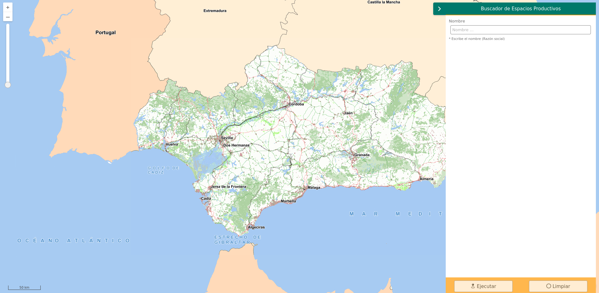

<p align="center">
  
</p>
<h1 align="center"><strong>API IDEE</strong> <small>🔌 IDEE.plugin.Searchpanel</small></h1>

# Descripción

 Plugin para la generación automática de paneles de búsquedas para realizar consultas a diferentes cores de geosearch. 



# Dependencias

Para que el plugin funcione correctamente es necesario importar las siguientes dependencias en el documento html:
Para uso de implementación OpenLayers:
- **searchpanel.ol.min.js**
- **searchpanel.ol.min.css**

Para uso de implementación Cesium:
- **searchpanel.cesium.min.js**
- **searchpanel.cesium.min.css**

# Uso del histórico de versiones

Existe un histórico de versiones de todos los plugins en el directorio `legacy/` de cada plugin. 
Es recomendable fijar las versiones para evitar errores inesperados.

Ejemplo con el plugin searchpanel, implementación OpenLayers y versión 1.0.0:
- searchpanel-1.0.0.ol.min.css
- searchpanel-1.0.0.ol.min.js


# Parámetros

El constructor se inicializa con un JSON con los siguientes atributos:

- **options [object]:** Objeto con opciones de configuración. Solo cuenta con la propiedad position
  - **position [string]:** Opción de localización del plugin admite:   
    - ***Top Left:*** 'TL' Posicionamiento en la esquina superior izquierda
    -  ***'Bottom Left':*** 'BL' Posicionamiento en la esquina inferior izquierda
    - ***'Top Right:***  'TR' Posicionamiento en la esquina superior derecha
    - ***'Bottom Right':*** 'BR' Posicionamiento en la esquina inferior derecha
  
- **config [object]:** Objeto con los parámetros de configuración propios de las búsquedas. Contiene las siguientes propiedades:
  - **title [string]:** Título del panel. El título aparecerá tanto al dejar el ratón encima del boton del plugin a modo de Tooltip como en la parte superior del panel.
  - **geosearchUrl [string]:** url del core de geosearch al cual se desea consultar. La url deberá acabar con el símbolo **?**
  - **maxResults [integer]:**  Número máximo de registros que se desea recibir. Esto permite  el número de resultados devueltos facilitando la paginación y los tiempos de respuesta del geosearch
  - **fields: [array]** Campos sobre los que se desea buscar.(Array). Listado de campos que se desea que aparezcan en el Panel de buscador para realizar los filtros. Es necesario incluir los siguientes parámetros:
    - ***field:*** Nombre del campo en el core de geosearh
    - ***alias:*** Texto descriptivo del campo
    - ***label:*** Texto a mostar a modo de ayuda 
  - **infoFields: [array]** Campos que se desean mostrar una vez optenidos los resultados. El orden de definición de estos afecta al orden de aparición en la tabla resultante.
    - ***field:*** Nombre del campo en el core de geosearh
    - ***alias:*** Texto descriptivo del campo

# API-REST

```javascript
URL_API?searchpanel
```

<table>
  <tr>
    <th>Parámetros</th>
    <th>Opciones/Descripción</th>
    <th>Disponibilidad</th>
  </tr>
  <tr>
    <td>options</td>
    <td>Objeto para indicar la posición</td>
    <td>Base64 ❌ | Separador ✔️</td>
  </tr>
  <tr>
    <td>config</td>
    <td>Objeto de configuraciones</td>
    <td>Base64 ❌ | Separador ✔️</td>
  </tr>
</table>

### Ejemplos de uso API-REST

```
https://componentes.idee.es/api-idee?searchpanel
```

```
https://componentes.idee.es/api-idee?searchpanel
```
### Ejemplos de uso API-REST en base64

Para la codificación en base64 del objeto con los parámetros del plugin podemos hacer uso de la utilidad IDEE.utils.encodeBase64.
Ejemplo:
```javascript
IDEE.utils.encodeBase64(obj_params);
```

Ejemplo de constructor del plugin:

```javascript
{
  options: {
    position: 'TL'
  },
  config: {
    title: 'Buscador de Espacios Productivos',
    geosearchUrl: 'https://www.juntadeandalucia.es/institutodeestadisticaycartografia/geobusquedas/eepp-f1/search?',
    maxResults: 100,
    fields: [
      {
        field: 'municipio',
        alias: 'Municipio',
        label: 'Escribe el nombre del Municipio',
      },
      {
        field: 'provincia',
        alias: 'Provincia',
        label: 'Escribe el nombre de la Provincia',
      },
      {
        field: 'nombre',
        alias: 'Nombre',
        label: 'Escribe el nombre del Espacio Productivo',
      }
    ],
    infoFields: [
      {
        field: 'nombre',
        alias: 'Nombre '
      },
      {
        field: 'tipologia',
        alias: 'Tipología'
      },
      {
        field: 'municipio',
        alias: 'Municipio'
      },
      {
        field: 'provincia',
        alias: 'Provincia'
      }
    ]
  }
}
```

```
https://componentes.idee.es/api-idee/?searchpanel=base64=eyJvcHRpb25zIjp7InBvc2l0aW9uIjoiVEwifSwiY29uZmlnIjp7InRpdGxlIjoiQnVzY2Fkb3IgZGUgRXNwYWNpb3MgUHJvZHVjdGl2b3MiLCJnZW9zZWFyY2hVcmwiOiJodHRwczovL3d3dy5qdW50YWRlYW5kYWx1Y2lhLmVzL2luc3RpdHV0b2RlZXN0YWRpc3RpY2F5Y2FydG9ncmFmaWEvZ2VvYnVzcXVlZGFzL2VlcHAtZjEvc2VhcmNoPyIsIm1heFJlc3VsdHMiOjEwMCwiZmllbGRzIjpbeyJmaWVsZCI6Im11bmljaXBpbyIsImFsaWFzIjoiTXVuaWNpcGlvIiwibGFiZWwiOiJFc2NyaWJlIGVsIG5vbWJyZSBkZWwgTXVuaWNpcGlvIn0seyJmaWVsZCI6InByb3ZpbmNpYSIsImFsaWFzIjoiUHJvdmluY2lhIiwibGFiZWwiOiJFc2NyaWJlIGVsIG5vbWJyZSBkZSBsYSBQcm92aW5jaWEifSx7ImZpZWxkIjoibm9tYnJlIiwiYWxpYXMiOiJOb21icmUiLCJsYWJlbCI6IkVzY3JpYmUgZWwgbm9tYnJlIGRlbCBFc3BhY2lvIFByb2R1Y3Rpdm8ifV0sImluZm9GaWVsZHMiOlt7ImZpZWxkIjoibm9tYnJlIiwiYWxpYXMiOiJOb21icmUgIn0seyJmaWVsZCI6InRpcG9sb2dpYSIsImFsaWFzIjoiVGlwb2xvZ8OtYSJ9LHsiZmllbGQiOiJtdW5pY2lwaW8iLCJhbGlhcyI6Ik11bmljaXBpbyJ9LHsiZmllbGQiOiJwcm92aW5jaWEiLCJhbGlhcyI6IlByb3ZpbmNpYSJ9XX19
```

# Ejemplo de uso

```javascript

const configSearchPanel = {
  options: {
    position: 'TL'
  },
  config: {
    title: 'Buscador de Espacios Productivos',
    geosearchUrl: 'https://www.juntadeandalucia.es/institutodeestadisticaycartografia/geobusquedas/eepp-f1/search?',
    maxResults: 100,
    fields: [
      {
        field: 'municipio',
        alias: 'Municipio',
        label: 'Escribe el nombre del Municipio',
      },
      {
        field: 'provincia',
        alias: 'Provincia',
        label: 'Escribe el nombre de la Provincia',
      },
      {
        field: 'nombre',
        alias: 'Nombre',
        label: 'Escribe el nombre del Espacio Productivo',
      }
    ],
    infoFields: [
      {
        field: 'nombre',
        alias: 'Nombre '
      },
      {
        field: 'tipologia',
        alias: 'Tipología'
      },
      {
        field: 'municipio',
        alias: 'Municipio'
      },
      {
        field: 'provincia',
        alias: 'Provincia'
      }
    ]
  }
}

const mp = new IDEE.plugin.Searchpanel(configSearchPanel);
map.addPlugin(mp);
```

# 👨‍💻 Desarrollo

Para el stack de desarrollo de este componente se ha utilizado

* NodeJS Version: 14.16
* NPM Version: 6.14.11
* Entorno Windows.

## 📐 Configuración del stack de desarrollo / *Work setup*


### 🐑 Clonar el repositorio / *Cloning repository*

Para descargar el repositorio en otro equipo lo clonamos:

```bash
git clone [URL del repositorio]
```

### 1️⃣ Instalación de dependencias / *Install Dependencies*

```bash
npm i
```

### 2️⃣ Arranque del servidor de desarrollo / *Run Application*

```bash
npm start:ol
npm start:cesium
```

## 📂 Estructura del código / *Code scaffolding*

```any
/
├── src 📦                  # Código fuente
├── task 📁                 # EndPoints
├── test 📁                 # Testing
├── webpack-config 📁       # Webpack configs
└── ...
```
## 📌 Metodologías y pautas de desarrollo / *Methodologies and Guidelines*

Metodologías y herramientas usadas en el proyecto para garantizar el Quality Assurance Code (QAC)

* ESLint
  * [NPM ESLint](https://www.npmjs.com/package/eslint) \
  * [NPM ESLint | Airbnb](https://www.npmjs.com/package/eslint-config-airbnb)

## ⛽️ Revisión e instalación de dependencias / *Review and Update Dependencies*

Para la revisión y actualización de las dependencias de los paquetes npm es necesario instalar de manera global el paquete/ módulo "npm-check-updates".

```bash
# Install and Run
$npm i -g npm-check-updates
$ncu
```