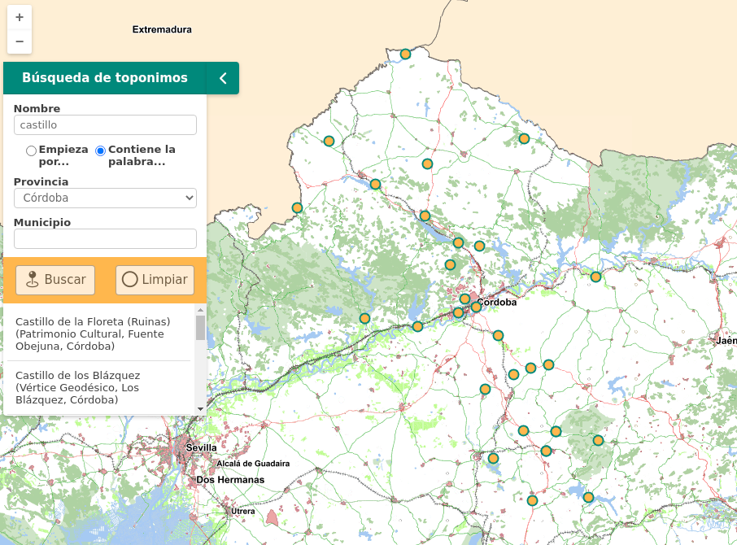

<p align="center">
  
</p>
<h1 align="center"><strong>API IDEE</strong> <small>🔌 IDEE.plugin.Toponomysearch</small></h1>

# Descripción

Plugin que permite realizar búsquedas de topónimos contra el servicio wfs-nga del Instituto de Estadística y Cartografía de Andalucía.



# Dependencias

Para que el plugin funcione correctamente es necesario importar las siguientes dependencias en el documento html:
Para uso de implementación OpenLayers:
- **toponomysearch.ol.min.js**
- **toponomysearch.ol.min.css**

Para uso de implementación Cesium:
- **toponomysearch.cesium.min.js**
- **toponomysearch.cesium.min.css**

# Uso del histórico de versiones

Existe un histórico de versiones de todos los plugins en el directorio `legacy/` de cada plugin. 
Es recomendable fijar las versiones para evitar errores inesperados.

Ejemplo con el plugin toponomysearch, implementación OpenLayers y versión 1.0.0:
- toponomysearch-1.0.0.ol.min.css
- toponomysearch-1.0.0.ol.min.js

# Parámetros

El constructor se inicializa con un JSON con los siguientes atributos:
- **url**. URL base del servicio de geobúsquedas. Por defecto: `'https://geobusquedas-sigc.juntadeandalucia.es'`
- **core**. Nombre del núcleo o colección del servicio de geobúsquedas a utilizar. Por defecto: `'sigc'`
- **handler**. Endpoint del servicio para realizar las búsquedas. Por defecto: `'/search?'`
- **params**. Objeto con parámetros adicionales de búsqueda que se enviarán al servicio. Por defecto: `{}`

# API-REST

```javascript
URL_API?geosearch=url*core*handler
```

<table>
    <tr>
        <th>Parámetros</th>
        <th>Opciones/Descripción</th>
        <th>Disponibilidad</th>
    </tr>
    <tr>
        <td>url</td>
        <td>URL del servicio de geobúsquedas</td>
        <td>Base64 ✔️ | Separador ✔️</td>
    </tr>
    <tr>
        <td>core</td>
        <td>Nombre del núcleo/colección del servicio</td>
        <td>Base64 ✔️ | Separador ✔️</td>
    </tr>
    <tr>
        <td>handler</td>
        <td>Endpoint del servicio de búsqueda</td>
        <td>Base64 ✔️ | Separador ✔️</td>
    </tr>
    <tr>
        <td>params</td>
        <td>Objeto con parámetros adicionales de búsqueda</td>
        <td>Base64 ✔️ | Separador ❌</td>
    </tr>
</table>

### Ejemplos de uso API-REST
```
https://componentes.idee.es/api-idee?toponomysearch=url*core*handler
```

```
https://componentes.idee.es/api-idee?toponomysearch=https://geobusquedas-sigc.juntadeandalucia.es/*sigc*/search&projection=EPSG:25830&wmcfile=https://componentes.idee.es/estaticos/Datos/WMC/mapa.xml*Mapa
```


### Ejemplo de uso API-REST en base64

Para la codificación en base64 del objeto con los parámetros del plugin podemos hacer uso de la utilidad IDEE.utils.encodeBase64.
Ejemplo:
```javascript
IDEE.utils.encodeBase64(obj_params);
```

Ejemplo de constructor:
```javascript
{
  url: 'https://geobusquedas-sigc.juntadeandalucia.es',
  core: 'sigc',
  handler: '/search?',
}
```
```
https://componentes.idee.es/api-idee?toponomysearch=base64=eyJ1cmwiOiJodHRwczovL2dlb2J1c3F1ZWRhcy1zaWdjLmp1bnRhZGVhbmRhbHVjaWEuZXMiLCJjb3JlIjoic2lnYyIsImhhbmRsZXIiOiIvc2VhcmNoPyJ9&projection=EPSG:25830&wmcfile=https://componentes.idee.es/estaticos/Datos/WMC/mapa.xml*Mapa
```

# Ejemplo de uso

### Ejemplo 1
```javascript
   const map = IDEE.map({
     container: 'map'
   });

   const mp = new IDEE.plugin.Toponomysearch({
      url: 'https://geobusquedas-sigc.juntadeandalucia.es',
      core: 'sigc',
      handler: '/search?',
    });
   map.addPlugin(mp);
```

# 👨‍💻 Desarrollo

Para el stack de desarrollo de este componente se ha utilizado

* NodeJS Versión: 16 o superior
* NPM Versión: 8.19.4 o superior

## 📐 Configuración del stack de desarrollo / *Work setup*


### 🐑 Clonar el repositorio / *Cloning repository*

Para descargar el repositorio en otro equipo lo clonamos:

```bash
git clone [URL del repositorio]
```

### 1️⃣ Instalación de dependencias / *Install Dependencies*

```bash
npm i
```

### 2️⃣ Arranque del servidor de desarrollo / *Run Application*

```bash
npm run start:ol
npm run start:cesium
```

## 📂 Estructura del código / *Code scaffolding*

```any
/
├── src 📦                  # Código fuente
├── legacy 📁               # Histórico de versiones
├── task 📁                 # EndPoints
├── test 📁                 # Testing
├── webpack-config 📁       # Webpack configs
└── ...
```
## 📌 Metodologías y pautas de desarrollo / *Methodologies and Guidelines*

Metodologías y herramientas usadas en el proyecto para garantizar el Quality Assurance Code (QAC)

* ESLint
  * [NPM ESLint](https://www.npmjs.com/package/eslint) \
  * [NPM ESLint | Airbnb](https://www.npmjs.com/package/eslint-config-airbnb)

## ⛽️ Revisión e instalación de dependencias / *Review and Update Dependencies*

Para la revisión y actualización de las dependencias de los paquetes npm es necesario instalar de manera global el paquete/ módulo "npm-check-updates".

```bash
# Install and Run
$npm i -g npm-check-updates
$ncu
```

